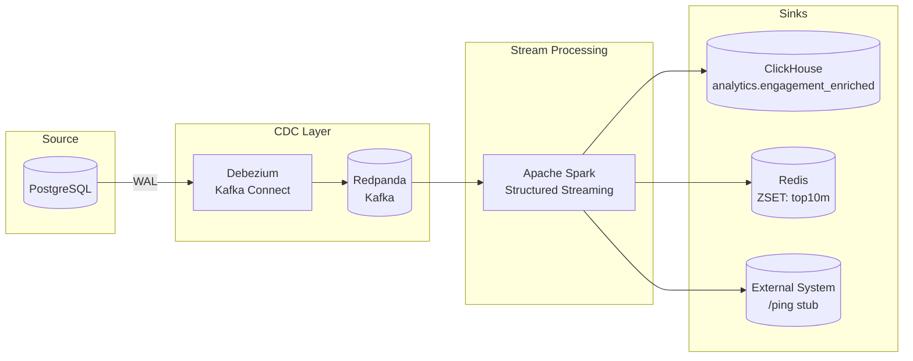

# Eventstream Fanout
**Postgres → Debezium → Redpanda (Kafka) → Spark Structured Streaming → (Redis + ClickHouse) [+ External API]**

A runnable demo showcasing reliable **change data capture**, **stream enrichment**, and **multi-sink fan-out**:
- **Columnar analytics sink** *(ClickHouse here; swappable to BigQuery in cloud environments)*
- **Redis** for near-real-time leaderboards (rolling last 10 minutes)
- **External system** (HTTP stub) to prove outbound integrations

**Goal:** one-command bring-up, observe CDC in Kafka, verify enriched rows in ClickHouse, and see live leaderboards in Redis—along with clear design notes.

---

## Table of contents
- [Architecture](#architecture)
- [What’s included](#whats-included)
- [Transformations & enrichment](#transformations--enrichment)
- [Prerequisites](#prerequisites)
- [Quick start (≈5 minutes)](#quick-start-5-minutes)
- [Useful URLs (localhost)](#useful-urls-localhost)
- [Repository layout](#repository-layout)
- [Manual run](#manual-run)
- [Verify data yourself](#verify-data-yourself)
- [Reset / teardown](#reset--teardown)
- [Backfill & reprocessing](#backfill--reprocessing)
- [Exactly-once (effectively-once in practice)](#exactly-once-effectively-once-in-practice)
- [External system (stub)](#external-system-stub)
- [Source schema (context)](#source-schema-context)
- [Smoke test expectations](#smoke-test-expectations)
- [Troubleshooting](#troubleshooting)
- [Production hardening (out of scope, suggested)](#production-hardening-out-of-scope-suggested)
- [Feature checklist](#feature-checklist)
- [License & notes](#license--notes)

---

## Architecture


**Why this shape?**
- **Debezium** emits reliable row-level changes from PostgreSQL as a standard CDC envelope.
- **Redpanda (Kafka-compatible)** simplifies local ops and observability while remaining Kafka API-compatible.
- **Spark Structured Streaming** enables stateful operations and coordinated **fan-out** in a single job.
- **Redis** fits low-latency, short-window aggregations (leaderboards, recency).
- **ClickHouse** acts as a fast local columnar warehouse; switch to **BigQuery** in GCP with the Spark BigQuery connector.

---

## What’s included

- **CDC topic:** `cdc.public.engagement_events` (Debezium envelope)
- **Spark job:** consumes CDC, enriches from `content`, writes to:
  - **Redis** ZSET `top10m` (rolling 10-minute leaderboard)
  - **ClickHouse** table `analytics.engagement_enriched`
  - **External HTTP stub** (simple integration proof)

> **Demo credentials (do not use in production):**  
> Postgres: `app/app` • ClickHouse: `app/app` • Redis: no auth

---

## Transformations & enrichment

- Join with `content` to fetch `content_type` and `length_seconds`.
- Derive `engagement_seconds = duration_ms / 1000.0`.
- Compute `engagement_pct = ROUND(engagement_seconds / length_seconds, 2)`.
  - If either `length_seconds` or `duration_ms` is missing, set `engagement_pct` to `NULL`.
- Preserve `event_ts`, `event_type`, `device`, and `raw_payload`.

**Redis (last 10 minutes):**
- Maintain ZSET `top10m` keyed by `content_id` with a score representing aggregated recent engagement.
- Sliding window of 10 minutes with periodic pruning inside the streaming job.

**Latency target:** Redis updates should appear **< 5 seconds** after a new event is written to Postgres (typical local machine).

---

## Prerequisites

- Docker + Docker Compose v2 (`docker compose ...`)
- `curl`
- *(Optional)* `jq`, `rpk` (Redpanda CLI). We call `rpk` inside the container, so you don’t need it locally.

---

## Quick start (≈5 minutes)
> If you see “permission denied” on any script, run:
> 
> `chmod +x scripts/*.sh`

1) Clone and enter the repository:
~~~bash
git clone https://github.com/ahmed-badawood/eventstream-fanout.git
cd eventstream-fanout
~~~

2) Bring everything up, register the connector, and run a smoke test:
~~~bash
./scripts/up.sh
~~~

The script will:
- `docker compose up -d`
- wait for **Kafka Connect** and register Debezium *(idempotent)*
- wait for **Postgres**
- seed two test events *(valid UUIDs)*
- consume one CDC message from Kafka
- show **ClickHouse** and **Redis** results

If ClickHouse shows `0` rows on the very first run, give Spark ~5–10 seconds, then:
~~~bash
./scripts/smoke.sh
~~~

---

## Useful URLs (localhost)

- **Redpanda Console:** http://localhost:8080  
  *(watch topic `cdc.public.engagement_events`)*
- **Kafka Connect REST:** http://localhost:8083  
  *(connector name: `pg-engagement-cdc`)*
- **External API stub:** http://localhost:8081/ping → `Ok.`
- **ClickHouse HTTP ping:** `curl -u app:app http://localhost:8123/ping` → `Ok.`

**Ports summary**

| Service         | Port(s)     |
|-----------------|-------------|
| Redpanda UI     | 8080        |
| Kafka Connect   | 8083        |
| External API    | 8081        |
| ClickHouse HTTP | 8123        |

---

## Repository layout

```text
.
├─ docker-compose.yml
├─ sql/
│  └─ 00_init_schema.sql          # Postgres DDL + seed content row
├─ connect/
│  └─ debezium-postgres.json      # Debezium connector config
├─ pipeline/
│  ├─ Dockerfile
│  └─ app.py                      # Spark Structured Streaming job
├─ external-api/
│  ├─ Dockerfile
│  └─ app.py                      # Simple HTTP stub (called by pipeline)
├─ clickhouse/
│  └─ init.sql                    # analytics.engagement_enriched (valid types)
└─ scripts/
   ├─ up.sh                       # bring up, register connector, smoke test
   ├─ register_connector.sh       # idempotent connector registration
   └─ smoke.sh                    # seed & verify (Kafka/ClickHouse/Redis)
```

## Manual run

**Bring everything up**
    
    docker compose up -d

**Register Debezium connector (idempotent)**
    
    ./scripts/register_connector.sh

**Seed & verify**
    
    ./scripts/smoke.sh

---

## Verify data yourself

**Kafka topic (inside container)**
    
    docker compose exec -T redpanda \
      rpk topic consume cdc.public.engagement_events --brokers redpanda:9092 -n 1

**ClickHouse (inside container)**
    
    docker compose exec -T clickhouse \
      clickhouse-client -q "SELECT count() FROM analytics.engagement_enriched"

    
    docker compose exec -T clickhouse \
      clickhouse-client -q "
        SELECT content_id,event_type,engagement_seconds,engagement_pct
        FROM analytics.engagement_enriched
        ORDER BY event_ts DESC
        LIMIT 5
      "

**Redis leaderboard (inside container)**
    
    docker compose exec -T redis \
      redis-cli ZREVRANGE top10m 0 9 WITHSCORES

---

## Reset / teardown

**Reset everything including data** (Postgres, ClickHouse, Redis, Kafka topics & offsets):
    
    docker compose down -v

Then start fresh:
    
    ./scripts/up.sh

---

## Backfill & reprocessing

- Kafka offset rewind: start the Spark job with a fresh checkpoint to re-consume from an earlier offset/time.
- DB snapshot: let Debezium run an initial (or partial) snapshot if the connector is recreated.
- Idempotency note: the sinks are designed for effectively-once via Kafka offsets + Spark checkpoints. For production, add explicit dedup/upsert in the analytics store and consistent write keys.

---

## Exactly-once (effectively-once in practice)

- Source: Kafka offsets + Spark checkpointing provide resilient processing per partition.
- Redis: ZSET updates and time-window pruning are designed to tolerate retries; results remain stable under reprocessing.
- ClickHouse: batch inserts are consistent per micro-batch; for stronger guarantees, use MergeTree dedup keys or idempotent upserts.

> For stricter end-to-end guarantees across heterogeneous sinks, consider an outbox pattern and sink-specific idempotency keys.

---

## External system (stub)

- Minimal HTTP service receiving a call from the pipeline to prove external integration.
- Default endpoint: GET /ping returns Ok.
- Replace with a real webhook/REST integration in your environment.

---

## Source schema (context)

    -- Content catalogue ----------------------------------------------
    CREATE TABLE IF NOT EXISTS content (
        id              UUID PRIMARY KEY,
        slug            TEXT UNIQUE NOT NULL,
        title           TEXT        NOT NULL,
        content_type    TEXT CHECK (content_type IN ('podcast', 'newsletter', 'video')),
        length_seconds  INTEGER, 
        publish_ts      TIMESTAMPTZ NOT NULL
    );

    -- Raw engagement telemetry ---------------------------------------
    CREATE TABLE IF NOT EXISTS engagement_events (
        id           BIGSERIAL PRIMARY KEY,
        content_id   UUID REFERENCES content(id),
        user_id      UUID,
        event_type   TEXT CHECK (event_type IN ('play', 'pause', 'finish', 'click')),
        event_ts     TIMESTAMPTZ NOT NULL,
        duration_ms  INTEGER,      -- nullable for events without duration
        device       TEXT,         -- e.g. "ios", "web-safari"
        raw_payload  JSONB         -- anything extra the client sends
    );

---

## Smoke test expectations

- Kafka: new CDC messages appear in `cdc.public.engagement_events`.
- ClickHouse: new rows in `analytics.engagement_enriched` with derived fields present.
- Redis: `ZREVRANGE top10m 0 9 WITHSCORES` shows the most engaged content for the last 10 minutes.

---

## Troubleshooting

- "UNKNOWN_TOPIC_OR_PARTITION" in smoke test  
  Debezium may still be creating the topic or snapshotting. Re-run:
      
      ./scripts/smoke.sh

- Kafka Connect returns "409 already exists"  
  Expected on re-runs; registration is idempotent.

- ClickHouse error about `Nullable(LowCardinality(String))`  
  Avoided in `clickhouse/init.sql` by using valid type combinations.

- Spark can’t find Kafka source  
  The pipeline image loads `spark-sql-kafka-0-10` at runtime. If you modify `pipeline/app.py`, keep the package-loading line intact.

---

## Production hardening (out of scope, suggested)

- Secrets via Vault/KMS; no static credentials in configs.
- Observability: lag, throughput, error budgets, sink write latencies.
- Explicit dedup/upsert semantics in the analytics store.
- Retry & DLQ for external sink calls.
- Topic partitioning keyed by stable identifiers; tune parallelism for scale.
- Defined SLOs for latency, accuracy, and availability.

---

## Feature checklist

- [x] Core transforms: join + `engagement_seconds` + `engagement_pct`
- [x] Multi-sink fan-out (columnar + Redis + external)
- [x] Redis latency target < 5s
- [x] Time-window aggregation in Redis (last 10 minutes)
- [x] Backfill/reprocessing path
- [x] Stream processor (Spark) with strong delivery semantics
- [x] Repeatable runtime (Docker Compose + scripts)
- [x] Clear documentation of design & run-book

---

## License & notes

- Demonstration/reference stack. Harden before production use.
- PRs to improve docs or add BigQuery wiring are welcome.
